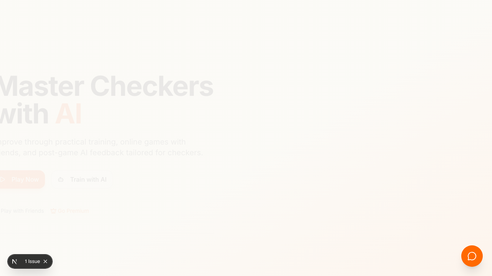
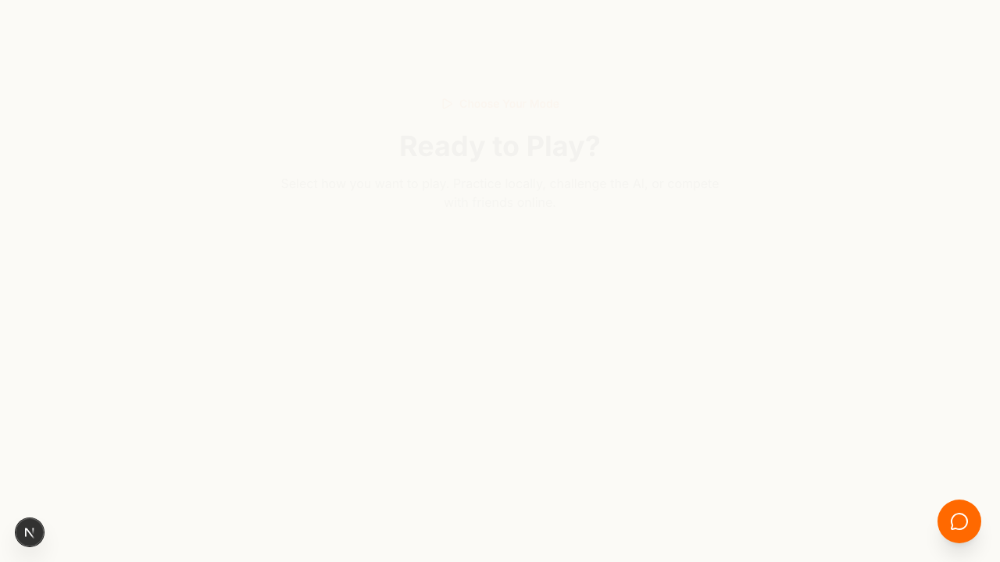
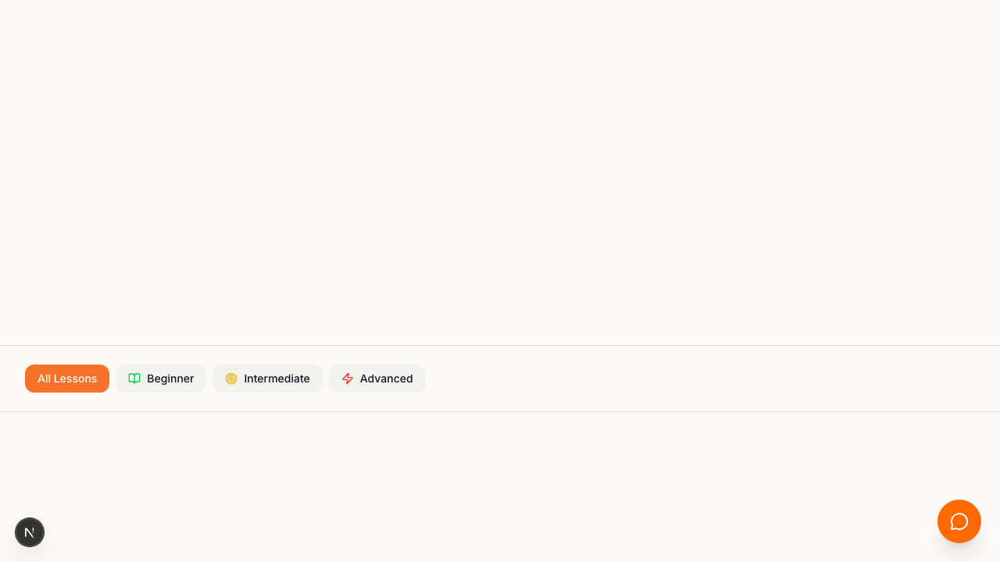
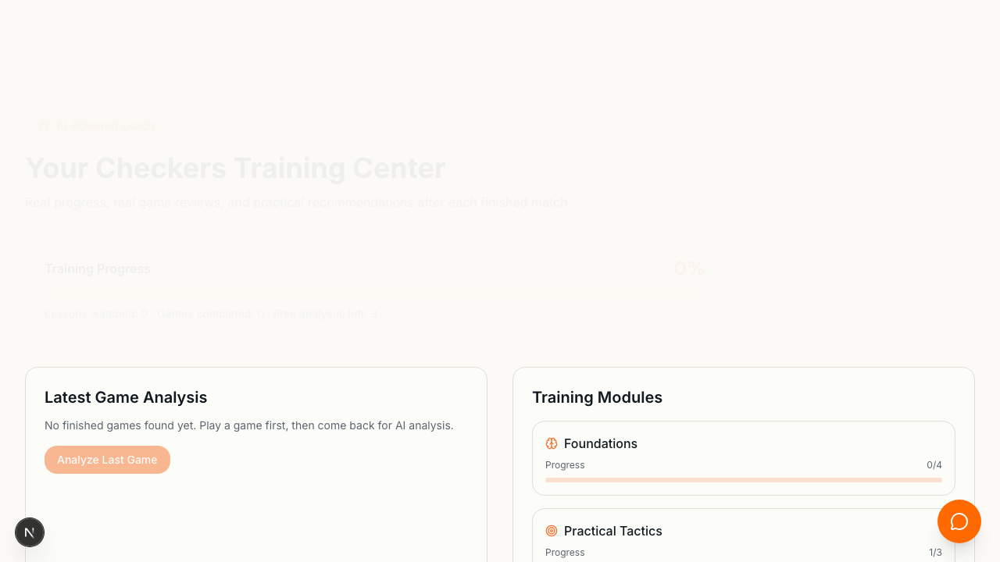
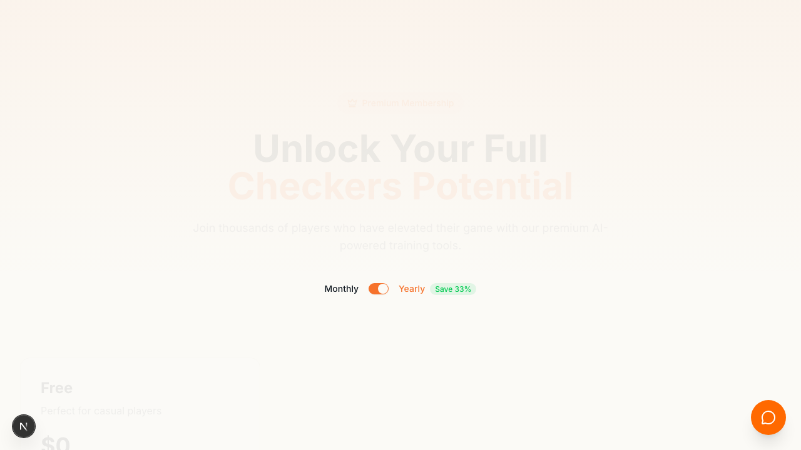

# Checkers AI

Checkers AI is a modern web app for learning, playing, and improving at checkers with AI coaching, online rooms, and premium customization.

## Beta notice

This project is currently in **beta/startup mode**.  
Until the official public launch, **everyone can activate Premium/Pro features in one click** from the Premium page (test mode enabled).

## Product gallery

### Home


### Play (AI / local board)


### Learn (video cards with embedded player)


### AI Coach (post-game analysis and training modules)


### Premium / Pro activation


### Play with Friend (online room)


## Core features

- Account registration and login
- Learn section with YouTube video previews and in-site playback
- AI coach with game analysis, recommendations, and training progress
- Premium and Pro test activation (no payment required in beta)
- Board theme unlocks by plan:
  - `Free`: Classic
  - `Premium`: Classic + Emerald
  - `Pro`: Classic + Emerald + Pearl
- Online multiplayer via Socket.IO room codes
- User activity logs and persistent user data

## How to use

1. Sign up or log in.
2. Open `Learn` and play lesson videos to grow learning progress.
3. Open `Play` and choose:
   - AI game
   - Local game
   - Friend room game
4. After game finish, view result popup and AI analysis.
5. Open `Premium` and click:
   - `Start Free Trial` -> activates Premium in test mode
   - `Go Pro` -> activates Pro in test mode
6. Return to game pages and verify unlocked premium features.

## Tech stack

- Frontend: Next.js 16, React 19, TypeScript, Tailwind, Framer Motion
- Realtime: Socket.IO client + Node.js Socket.IO backend
- AI: Gemini API integration
- Storage:
  - Production: Postgres (when `POSTGRES_URL`/`DATABASE_URL` is set)
  - Local fallback: `data/app-db.json`

## Local run

```bash
npm install
npm run dev
```

Open `http://localhost:3000`.

### Realtime backend for friend mode

```bash
cd backend
npm install
npm run dev
```

Backend runs at `http://localhost:3001`.

## Environment variables

Create `.env.local`:

```env
NEXT_PUBLIC_WS_URL=http://localhost:3001
GEMINI_API_KEY=your_key
GEMINI_MODEL=gemini-2.5-flash-lite
POSTGRES_URL=your_postgres_connection_string
```

If no Postgres URL is set, app uses local JSON fallback storage.

## Deploy to GitHub + Vercel

### 1) Push to GitHub

```bash
git add .
git commit -m "Release-ready beta build"
git push
```

### 2) Deploy frontend on Vercel

1. Import GitHub repo into Vercel
2. Set env vars:
   - `POSTGRES_URL` (or `DATABASE_URL`)
   - `GEMINI_API_KEY`
   - `GEMINI_MODEL`
   - `NEXT_PUBLIC_WS_URL` (public URL of realtime backend)
3. Deploy

### 3) Deploy realtime backend separately

`backend/src/server.js` is a long-running Socket.IO server and should be hosted separately (Render/Railway/Fly.io).  
Then set `NEXT_PUBLIC_WS_URL` in Vercel to that public backend URL.

## Production checklist

1. Signup/login persists after refresh
2. Premium/Pro activation persists after refresh
3. `/api/log/recent` returns activity logs from DB
4. Learn videos open and play in embedded modal
5. Two-device room test works (create/join/sync/disconnect/reconnect)
