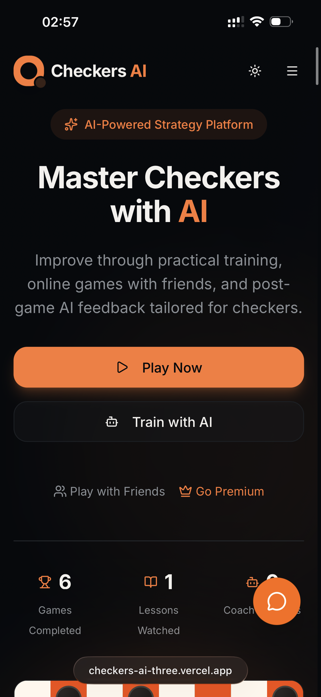
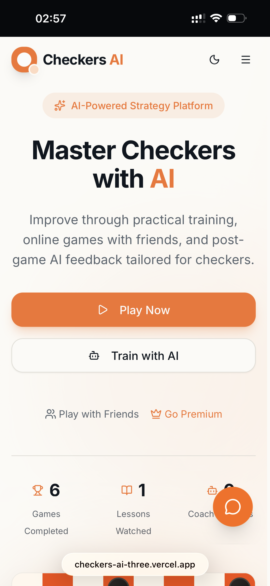
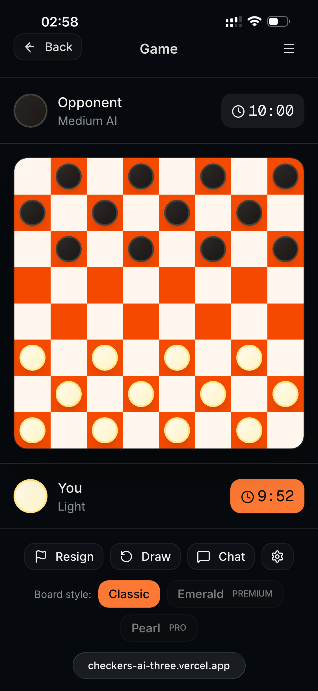
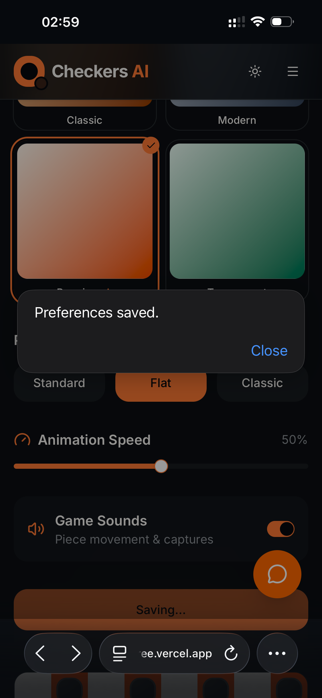
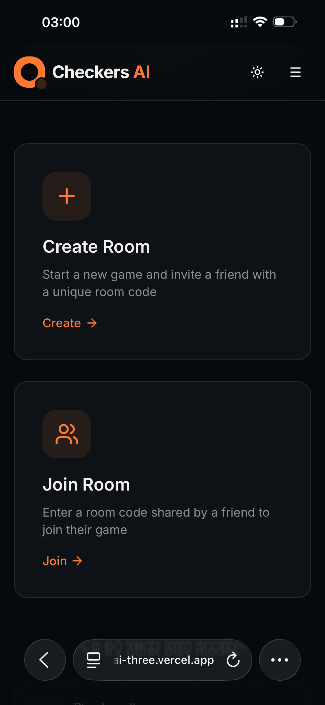
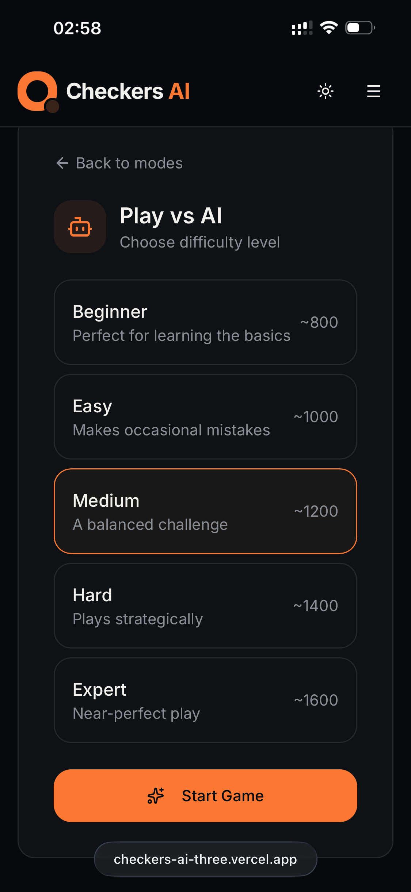

# Checkers AI

**Checkers AI** — интеллектуальная веб-платформа для обучения игре в шашки, практики в матчах против ИИ и игры с друзьями по сети в реальном времени.

Проект разработан и оформлен как продукт уровня startup/demo-day: акцент на UX, кроссплатформенность, AI-функции и online multiplayer с комнатами.

---

## Почему этот проект сильный

- Современный интерфейс в светлой и тёмной темах.
- Полный пользовательский путь: регистрация, профиль, обучение, игра, прогресс, рейтинг.
- Встроенный AI-слой: AI Coach, анализ партий, адаптивные обучающие модули.
- Realtime-архитектура через WebSocket/Socket.IO для режима “Play with Friend”.
- Кроссплатформенный опыт: одинаково удобно на desktop и mobile.
- Персонализация игрового опыта: темы доски, стили фигур, сохранение предпочтений.

---

## Startup/Beta статус

Сейчас продукт в **beta-режиме стартапа**.  
До официального релиза премиум-функции доступны в тестовом формате для демонстрации полного потенциала продукта.

---

## Ключевые функции

### 1) AI-first обучение и рост игрока
- Структурированные уроки от базовых принципов до продвинутой тактики.
- Прогресс обучения в реальном интерфейсе.
- AI Coach для пост-игрового разбора и рекомендаций.

### 2) Игра против ИИ
- Выбор уровней сложности от Beginner до Expert.
- Игровой интерфейс с таймерами, историей ходов и контролями партии.
- Режим ориентирован на практическую прокачку навыка.

### 3) Игра с другом онлайн (WebSocket)
- Создание комнаты с кодом.
- Вход по коду с другого устройства.
- Синхронизация матча в реальном времени.
- Технологическая база: Socket.IO/WebSocket.

### 4) Профиль и данные игрока
- Профиль с именем, почтой, рейтингом и игровой статистикой.
- Разделы с историей матчей, достижениями и метриками.
- Система хранения и использования игровых логов.

### 5) Кастомизация
- Визуальная настройка доски и фигур.
- Переключение тем и сохранение предпочтений.

### 6) Кроссплатформенность
- Адаптивный UI/UX для больших экранов и смартфонов.
- Все ключевые сценарии доступны с телефона без потери удобства.

---

## Premium Experience и монетизация

- В продукт встроены уровни подписки **Premium** и **Pro**.
- Подписки открывают расширенную кастомизацию: дополнительные темы доски, стили фигур, визуальные пресеты и beta-механики.
- Такой слой не только про визуал: это модель удержания и монетизации, где пользователь получает ощущение персонального игрового пространства.
- В beta-режиме часть платных возможностей может быть доступна для тестирования и сбора обратной связи перед production-релизом.

---

## Для кого этот продукт (целевая аудитория)

- **Новички**, которым нужно быстро и понятно освоить шашки через практику и guided-обучение.
- **Игроки без постоянного соперника**, которым нужен доступный AI-оппонент с разными уровнями сложности.
- **Друзья**, которые хотят играть онлайн в отдельных комнатах без сложной настройки (код комнаты + мгновенное подключение).
- **Соревновательные пользователи**, которым важны рейтинг, динамика роста, лидерборд и реальные метрики прогресса.
- **Пользователи, ориентированные на данные**, которым важно видеть, как история матчей влияет на ELO и позиции в таблице.

---

## Аутентификация и user identity

- Email/password регистрация и вход.
- OAuth-вход через **Google**.
- OAuth-вход через **GitHub**.
- После регистрации/логина данные пользователя (имя, email, рейтинг, история игр) используются в профиле, лидерборде и аналитических блоках.

---

## Визуальная витрина (Desktop)

### Главный экран: продуктовый оффер и быстрые точки входа

С первого экрана пользователь получает чёткий value proposition: играть, учиться с AI и приглашать друзей. Это демонстрирует продуктовую зрелость и понятный onboarding.

### Экран режимов игры

Раздел “Play” разделяет игровые сценарии: локально, против ИИ и онлайн с другом. Это снижает когнитивную нагрузку и ускоряет выбор нужного режима.

### Обучение: видео-уроки и визуальный прогресс

Карточки уроков с превью, длительностью и прогрессом формируют ощущение полноценной образовательной платформы, а не просто “доп. раздела”.

### AI Coach: анализ последней игры и модули развития

Секция AI Coach превращает матч в цикл роста: игра → разбор → рекомендации → следующая практика.

### Премиум/кастомизация

Кастомизация доски и стилей подчёркивает премиальность продукта и удержание через персональный игровой опыт.

### Онлайн-комнаты для игры с другом

Комнаты с кодом — центральная social-фича: быстрое подключение друзей, realtime-матч и живое взаимодействие.

---

## Визуальная витрина (Mobile / Cross-platform)

### Mobile: главный экран в тёмной теме

Полноценный mobile-first интерфейс с тем же уровнем продуктовой структуры, что и на desktop.

### Mobile: главный экран в светлой теме

Поддержка визуальных предпочтений пользователя и аккуратная читабельность в обоих режимах.

### Mobile: выбор сложности против ИИ

Все уровни сложности доступны в мобильном формате, что сохраняет глубину геймплея вне desktop.

### Mobile: игровой экран матча против ИИ

Таймеры, доска, контролы партии и чат остаются удобными даже на компактном экране.

### Mobile: создание/вход в комнату для игры с другом

Демонстрация WebSocket-сценария “создай комнату → передай код → играй онлайн” прямо со смартфона.

### Mobile: сохранение игровых предпочтений

Пользователь получает мгновенную обратную связь о сохранении настроек — важный элемент UX-надежности.

---

## Технологический стек

- **Frontend:** Next.js 16, React 19, TypeScript, Tailwind CSS, Framer Motion  
- **Realtime:** Socket.IO (WebSocket transport)  
- **AI:** Gemini API (для AI Coach / AI Support сценариев)  
- **Data layer:** Postgres (production), fallback JSON для локальных тестов  
- **Deploy:** Vercel (frontend) + отдельный backend-хостинг (Render/Railway/Fly и т.д.)

### Инструменты разработки и delivery

- **GitHub** — version control, ветки, ревью и delivery-процесс.
- **v0** — ускоренная генерация UI-скелетов и интерфейсных заготовок.
- **Codex / ChatGPT / Claude** — ускорение разработки, рефакторинг, архитектурные решения, документация и QA-поддержка.
- **Vercel** — production-деплой фронтенда, preview-сборки и environment management.
- **Render / Railway / Fly** — варианты хостинга realtime/backend-слоя.

---

## Архитектурная ценность

- UI и логика разделены по сценариям пользователя (learn / play / coach / profile).
- Realtime-режим вынесен в socket-слой для синхронной игры между устройствами.
- Серверные API-роуты закрывают аутентификацию, логи, профильные сводки и рейтинг.
- Структура подходит для масштабирования под реальную продуктовую нагрузку.

### Product mindset (не просто “программа”, а сервис)

- Проект спроектирован как продукт с реальными пользовательскими сценариями: обучение, игра, прогресс, конкуренция и social-взаимодействие.
- AI внедрён в пользовательский путь не ради «демо-эффекта», а как инструмент роста игрока и удержания.
- Монетизационный слой (Premium/Pro) и кастомизация интегрированы в core UX как часть go-to-market стратегии.
- Это демонстрация не только навыка кодинга, но и системного мышления: архитектура + UX + данные + масштабируемость + бизнес-логика.

---

## Запуск локально

### Frontend
```bash
npm install
npm run dev
```
Открыть: `http://localhost:3000`

### Realtime backend (Play with Friend)
```bash
cd backend
npm install
npm run dev
```
По умолчанию backend слушает `http://localhost:3001`

---

## Переменные окружения

Пример для `.env.local`:

```env
NEXT_PUBLIC_WS_URL=http://localhost:3001
GEMINI_API_KEY=your_key
GEMINI_MODEL=gemini-2.5-flash-lite
POSTGRES_URL=your_postgres_connection_string
DATABASE_URL=your_postgres_connection_string
```

---

## Конкурсный фокус

Этот проект демонстрирует не просто красивый интерфейс, а продуктовую систему:
- от первого входа пользователя до продвинутой игровой аналитики,
- от одиночной практики до сетевых матчей в реальном времени,
- от кроссплатформенного UX до AI-интеграций и data-driven подхода.

Именно такой баланс между инженерией, UX и growth-потенциалом делает **Checkers AI** сильным кандидатом для стартап-конкурсов и инкубаторов.
